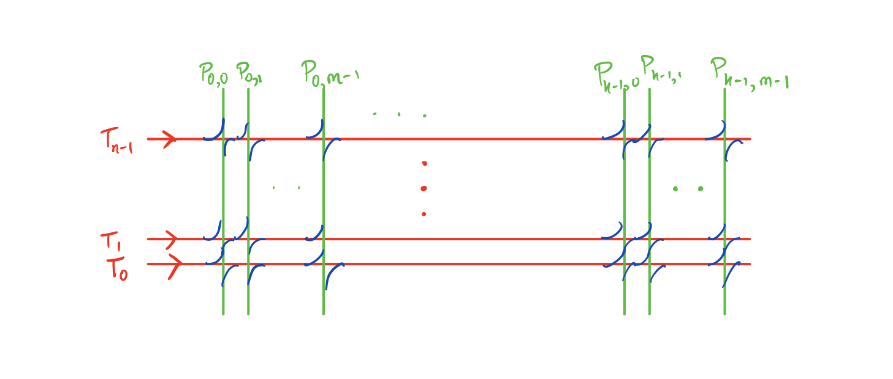

# counting-components

## Overview
Python module written in Rust to count components after resolving intersections via surgery.
Consider curves γ and δ on a possibly non-orientable surface S, where γ is a two-sided curve,
with intersection number k.
We encode the intersection using a tuple of a permutation π in S_k, and a subset f of {0,1,...,k-1}.
The permutation encodes how strands of δ come back to γ, and f encodes whether the strand comes back
with the local orientation flipped.

We take m parallel copies of δ, and n parallel copies of γ, and resolve all the intersections in a consistent
manner: we pick a direction on γ, and always turn left.


The functions in this module compute the number of one-sided and two-sided components in the resulting multicurve after resolving all the intersections.

## Documentation

### Objects
- `SignedPermutation`: A signed permutation is constructed via `SignedPermutation(<perm>, <flipset>)`, where `<perm>` is a list containing the numbers `0` to `n-1` representing a permutation, and `<flipset>` is a list of all strands whose local orientation gets flipped.
- `PyStrand`: A strand is constructed via `PyStrand(<strand-type>, m, n)`, where `<strand-type>` is either `'t'` or `'p'` corresponding to strands in the transverse or permutation direction. If it is a transverse strand, only the `m` argument is required, and indicates the index of the transverse strand, and if it is a permutation direction strand, then `m` and `n` indicate the permutation and copy index.

### Functions
- `get_next_major_strand(perm, m, n, strand)`: Given a permutation `perm`, `m`, `n`, and a strand `strand`, this function outputs the next strand the strand gets surgered to.
- `has_one_component(perm, m, n)`: Determines whether the resolved multicurve only has one component.
- `count_components_with_orientability(perm, m, n)`: Returns a tuple `(x, y)`, where `x` is the number of two-sided curves in the resulting multicurve, and `y` is the number of one-sided curves in the resulting multicurve.
- `count_components_upto_complexity(perm, complexity)`: Returns a list of all `(m,n)` such that `gcd(m,n) == 1`, `m+n <= k`, and the corresponding components. This function uses `rayon` to run on all available threads.
- `two_sided_multicurves_upto_complexity(perm, complexity)`: Returns a list of all `(m,n)` such that `gcd(m,n) == 1`, `m+n <= k`, such that the resolved multicurve only has two-sided components. This function uses `rayon` to run on all available threads.

## Build instructions
To build this library, you will need to pip install [maturin](https://github.com/PyO3/maturin), and the nightly version of the Rust compiler.
In the root of this project, run the following commands.
```
maturin build --release
pip install target/wheels/<file.whl>
```
You may need to upgrade to the latest version of pip to install the `.whl` file.